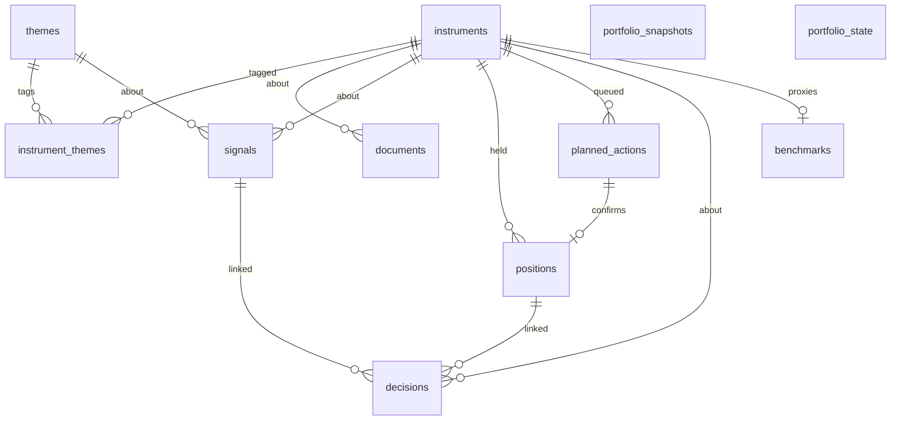

# Data Model

**Status:** Implemented (initial migration) — `supabase/migrations/20260811130000_init_schema.sql`

## Entities

| Table | Role |
|-------|------|
| `themes` | AI infra, Energy, Robotics/AI, Defence, Other |
| `instruments` | Tradable/watch entities |
| `instrument_themes` | Many-to-many with primary flag |
| `documents` | Filings, transcripts, press, etc. |
| `signals` | Manual or scorer-generated candidates |
| `positions` | Open/closed book |
| `planned_actions` | Intended buys/adds until a fill is confirmed |
| `decisions` | Thesis journal entries |
| `portfolio_snapshots` | Point-in-time NAV/cash/exposures |
| `portfolio_state` | Live cash; NAV = cash + open-position MTM |
| `dossiers` | Research stubs: thesis, risks, invalidation, next diligence |
| `benchmarks` | Success (SPY) and style (QQQ) index proxies; not research names |

## Enums

- `asset_class`: equity, etf, commodity_proxy, other
- `instrument_status`: watchlist, active, archived
- `benchmark_role`: success, style
- `signal_source`: manual, scorer
- `signal_status`: new, reviewing, acted, dismissed
- `position_status`: open, closed
- `position_side`: long, short
- `decision_type`: enter, add, reduce, exit, hold, watch
- `planned_action_type`: buy, add, reduce, sell
- `planned_action_status`: pending, deferred, confirmed, cancelled
- `document_type`: 10-k, 10-q, 8-k, earnings, transcript, press, other

## Access

RLS enabled on all tables. Phase 1 policies: full CRUD for `authenticated`.

## Seed

`supabase/seed.sql` inserts core themes (idempotent on `slug`).

## TypeScript

- Domain shapes: `@powerfund/domain`
- DB row types: `@powerfund/db` (`Database` interface) — refresh when schema changes
