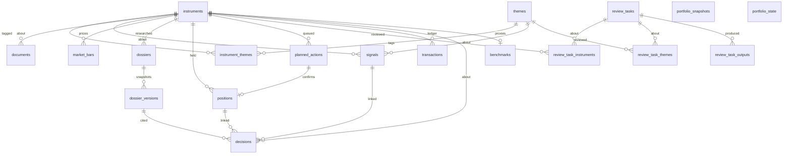

# Data Model

**Status:** Implemented — schema lives in `supabase/migrations/` (not only the initial file).

## Entities

| Table | Role |
|-------|------|
| `themes` | AI infra, Energy, Robotics/AI, Defence, Other |
| `instruments` | Tradable/watch entities; `is_benchmark` keeps SPY/QQQ off research lists |
| `instrument_themes` | Many-to-many with primary flag |
| `documents` | Filings, transcripts, press, etc. |
| `signals` | Manual or scorer-generated candidates |
| `market_bars` / `market_caps` / `fundamentals_quarterly` | Ingested prices and statements |
| `positions` | Open/closed book — projection of the ledger |
| `planned_actions` | Intended buys/adds/reduces/sells until a fill is confirmed |
| `review_tasks` | Reassess-thesis obligations (earnings, event windows, price conditions) |
| `review_task_instruments` / `review_task_themes` | Foreign keys for review scope |
| `review_task_outputs` | Links from a completed review to existing dossier versions, decisions, or planned actions |
| `transactions` | Append-only source of truth for cash and trades |
| `decisions` | Thesis journal; new rows pin `dossier_version_id` |
| `portfolio_snapshots` | Daily NAV / cash / invested / positions value |
| `portfolio_state` | Live cash; NAV = cash + open-position MTM |
| `dossiers` | Mutable current research header |
| `dossier_versions` | Immutable assembled snapshots for the journal |
| `benchmarks` | Success (SPY) and style (QQQ) index proxies |
| `app_users` | `operator` or `viewer` per auth user |
| `agent_idempotency_keys` | Replay store for agent POST/PATCH retries |

`positions` and `portfolio_state.cash` are maintained by a trigger on `transactions`. History is never edited; corrections are reversing or `adjustment` entries. See [ADR 0007](./decisions/0007-transactions-ledger.md).

`review_tasks` are not trades. Trigger evaluation may set `status=due`; it never inserts `transactions`, `positions`, or `planned_actions`. Completing a review records an outcome and optional links to rows that already exist. `dossiers.next_review_at` remains a live-header hint, not the obligation queue.

Dossier writes go through `save_dossier_versioned(...)`: one transaction updates the live `dossiers` row and inserts the next `dossier_versions` snapshot only when the assembled JSONB actually changed. `dossier_versions` is append-only.

## Enums

- `asset_class`: equity, etf, commodity_proxy, other
- `instrument_status`: watchlist, active, archived
- `benchmark_role`: success, style
- `app_role`: operator, viewer
- `transaction_kind`: deposit, withdrawal, buy, sell, dividend, interest, fee, adjustment
- `signal_source`: manual, scorer
- `signal_status`: new, reviewing, acted, dismissed
- `position_status`: open, closed
- `position_side`: long, short
- `decision_type`: enter, add, reduce, exit, hold, watch
- `planned_action_type`: buy, add, reduce, sell
- `planned_action_status`: pending, deferred, confirmed, cancelled
- `review_task_status`: pending, due, in_progress, completed, deferred, cancelled
- `review_task_scope`: company, theme, portfolio, macro
- `review_task_priority`: low, normal, high, urgent
- `review_output_kind`: dossier_version, decision, planned_action
- `document_type`: 10-k, 10-q, 8-k, earnings, transcript, press, other
- `dossier_status`: watch, investigate, active_thesis, passed
- `dossier_research_level`: draft, screened, primary_verified, investment_ready

## Access

RLS is on every `public` table. `anon` has no table privileges.

| Who | What |
|-----|------|
| `authenticated` | Read the research universe and the book |
| `operator` (`app_users.role`) | Write the book, dossiers, journal, queue, reviews |
| Service role | Ingest writes `market_bars`, `market_caps`, `fundamentals_quarterly` |
| Public catalog | Next.js `/api/v1/*` — weights and theses only, no dollars |
| Agent API | Next.js `/api/v1/agent/*` — Bearer keys, scoped reads/writes, no fills |

New sign-ups default to `viewer`. Roles live in `app_users`, not in user-editable JWT metadata.

## Seed

`supabase/seed.sql` inserts themes, the starter universe, dossier stubs, and the SPY/QQQ benchmark rows (idempotent).

## TypeScript

- Domain shapes: `@powerfund/domain`
- DB row types: `@powerfund/db` (`Database` interface) — refresh with `pnpm db:types` when schema changes
