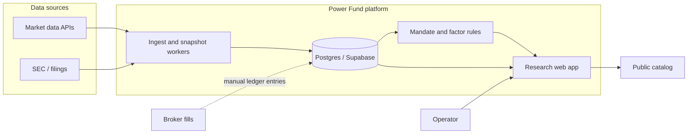

# Architecture Overview

**Status:** Operator research OS and book are live. Scoring / feature-store pipelines are still planned.

## Context

Power Fund is an investment intelligence system: research workflows, market ingest, portfolio and risk views, and a decision journal. Live capital decisions stay human-in-the-loop.

Product intent and mandate live in [`docs/`](../docs/README.md).

## Design goals

1. **System of record** for instruments, theses, the ledger, positions, and decisions.
2. **Pipelines** that turn raw market/filings/thematic data into explainable features and alerts.
3. **Operator UI** for weekly research and risk review.
4. **Extensibility** toward multi-user or insight products without a rewrite.
5. **Boring reliability** in ingestion and bookkeeping before advanced models.

## Context diagram



## Component map

| Component | Path | Status |
|-----------|------|--------|
| Web app | `apps/web` | Live: research, book, journal, risk, public `/api/v1`, private `/api/v1/agent` |
| Worker | `apps/worker` | Bars, fundamentals, NAV snapshot + backfill |
| Scheduled jobs | `netlify/functions` | Weekday EOD bars and snapshot |
| Domain | `packages/domain` | Mandate gates, factor map, unitized drawdown, TWR |
| Data clients | `packages/data-clients` | Tiingo → Yahoo → Stooq; SEC/Yahoo fundamentals |
| DB types | `packages/db` | Generated Supabase types |
| Postgres | `supabase/migrations` | Ledger, dossiers, versions, benchmarks, RLS |
| Feature store / scorers | — | Planned |
| Stress-beta model | — | Planned; mandate weights are not betas |

Risk rules (position/theme/cash caps, AI-capex and memory sleeves, kill-switch) run in `@powerfund/domain` and the web app. That is not a separate risk-engine service.

## Repo layout

```text
apps/web
apps/worker
packages/domain
packages/data-clients
packages/db
supabase/
docs/
architecture/
```

## Data flow (now vs later)

```text
now:    ingest bars/fundamentals → mark book → snapshot NAV → human review → ledger fill
later:  + entity resolve → features → scorers → alerts
```

No autonomous live trading.

## Next

1. [x] Connect web app to Supabase (auth + research + book)
2. [x] Seed the watchlist and write dossiers
3. [x] Ledger, fills, sells, deployment queue
4. [x] Daily bars + NAV snapshots; SPY/QQQ benchmarks
5. [x] Mandate factor map and unitized deployed drawdown
6. Filings-driven features and a first scorer
7. Document pipelines in `pipelines.md` when that work lands
