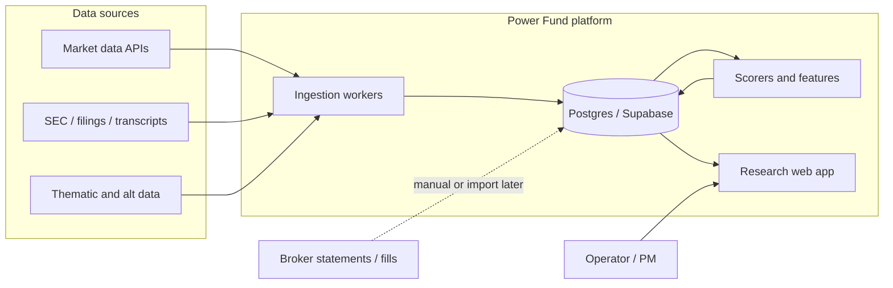

# Architecture Overview

**Status:** Phase 1 scaffold implemented; live data wiring next.

## Context

Power Fund is an investment intelligence system: research workflows, data pipelines, scoring, portfolio/risk views, and a decision journal. Live capital decisions remain human-in-the-loop initially.

Product intent and mandate live in [`docs/`](../docs/README.md).

## Design goals

1. **System of record** for instruments, theses, signals, positions, and decisions.
2. **Pipelines** that turn raw market/filings/thematic data into explainable features and alerts.
3. **Operator UI** optimized for weekly research and risk review.
4. **Extensibility** toward multi-user or insight products without requiring a rewrite.
5. **Boring reliability** in ingestion and bookkeeping before advanced models.

## Context diagram



## Component map

| Component | Path | Status | Phase |
|-----------|------|--------|-------|
| Web app | `apps/web` | Shell + IA; Netlify deploy config | 1 |
| Worker | `apps/worker` | Stub implemented | 1 / 2 |
| Domain package | `packages/domain` | Implemented | 1 |
| DB package | `packages/db` | Client + types | 1 |
| Postgres schema | `supabase/migrations` | Initial migration | 1 |
| Feature store / scorers | — | Planned | 2 |
| Risk engine | — | Planned | 3 |

## Repo layout

```text
apps/web
apps/worker
packages/domain
packages/db
supabase/
docs/
architecture/
```

## Data flow (target)

```text
ingest → normalize → entity resolve → features → scorers → alerts → human review → decision / position
```

No autonomous live trading in the initial architecture.

## Next

1. [x] Connect web app to local Supabase (auth + read themes/instruments)
2. [x] Seed starter universe (~24 names)
3. Company dossiers + signal/decision CRUD
4. Choose first market + filings data sources
5. Document pipelines in `pipelines.md` when workers do real work
