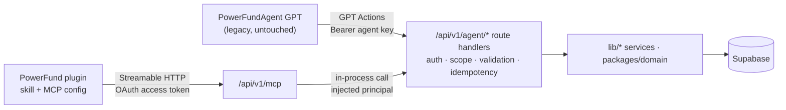

# MCP architecture

How PowerFund exposes its agent capabilities over the Model Context Protocol,
and why it is built this way. The tool catalog is [mcp-tools.md](./mcp-tools.md).
The operational runbook for moving the GPT is
[gpt-to-plugin-migration.md](./gpt-to-plugin-migration.md).

```
REST API  = PowerFund's application interface   /api/v1/agent/*   (unchanged)
MCP tools = the agent's capability interface    /api/v1/mcp
Skill     = how to run the book                 plugins/powerfund/skills/powerfund
```

## Why this exists

OpenAI is retiring custom GPTs in favour of plugins. Its migration flow turns a
GPT's instructions into a skill and copies its knowledge files into the plugin.
It **does not migrate custom Actions**. PowerFundAgent's whole connection to the
book is Actions over `/api/v1/agent/*`, so a migrated plugin would keep its
reasoning and lose every read and write. OpenAI's replacement for custom
Actions is an MCP server. `/api/v1/mcp` is that server.

The migration is parallel, not a cutover:



The REST API is not modified in any client-visible way. It stays the GPT's
interface until the GPT is retired, and the fallback after that.

## Platform facts, checked 28 September 2026

Several of these differ from what the migration brief assumed.

| Area | What is current | Consequence here |
|------|-----------------|------------------|
| **MCP TypeScript SDK** | **v2 is the stable line.** `@modelcontextprotocol/server` 2.1.0 replaces the monolithic `@modelcontextprotocol/sdk` (1.30.x, still maintained). Schemas are Standard Schema (zod ≥ 4.2) | Built on v2. v1-era examples (`sdk/server/mcp.js`, raw-shape `inputSchema`, `extra.authInfo`) are out of date |
| **MCP spec** | **2026-07-28** makes the protocol stateless: no `initialize` handshake, no `Mcp-Session-Id`, per-request `_meta` envelope, a new `server/discover`, and the HTTP GET stream replaced by `subscriptions/listen` | The server answers both eras from one definition: 2025-era clients (ChatGPT and MCP Inspector today) through the stateless idiom, 2026-07-28 clients through the SDK's per-request handler. A test asserts both list identical tools |
| **Client registration** | The 2026-07-28 spec **deprecates DCR** in favour of Client ID Metadata Documents; ChatGPT prefers CIMD and publishes `https://chatgpt.com/oauth/client.json` | CIMD is the primary path; DCR remains for Inspector/CLIs |
| **ChatGPT auth modes** | OAuth, no auth, or mixed. **No static bearer / API-key option** for MCP connectors | OAuth is on the critical path to ChatGPT testing, not a later hardening step |
| **ChatGPT's client** | Its CIMD document supports `none` and `private_key_jwt` token auth and redirects to `https://chatgpt.com/connector_platform_oauth_redirect`, the issuer-identified redirect, which requires `iss` on every authorization response | Public-client exchange with PKCE; `iss` always returned |
| **securitySchemes** | ChatGPT reads it as a **top-level tool field**, with `_meta.securitySchemes` as a back-compat mirror. The SDK emits only `_meta` | `tools/list` is wrapped to add the top-level copy. A test guards it |
| **Plugin package** | Portable format: root `plugin.json` (`$schema` agent-plugins.org, `name`, `version`, `description`), root `mcp.json` (`mcpServers.<name>.type: "streamable-http"`, `url`), `skills/<name>/SKILL.md` with `name`/`description` front matter; OpenAI specifics under `extensions["com.openai"]` in `plugin.json` | `plugins/powerfund/` |
| **GPT retirement** | Announced 11 September 2026. Reported: Enterprise GPTs stop running 11 December 2026. After migration the GPT is read-only but usable until retired | Confirm the date for this account in OpenAI's help centre before relying on it |
| **Supabase OAuth server** | Public beta. DCR yes, **CIMD no**. Tokens are ordinary Supabase JWTs with no resource-bound audience, and custom scopes need an access-token hook | Not used — see [Authentication](#authentication) |
| **Netlify** | Next.js route handlers run in the adapter's serverless function: **60 s** synchronous limit, **6 MB** buffered payload (streamed: 60 s, 20 MB). Middleware runs as an Edge Function | Per-tool budget 20 s; JSON responses only; body cap 1 MB |
| **search / fetch tools** | Only required for ChatGPT deep research and company knowledge | Not implemented. PowerFund is not a document corpus |

## The existing Agent API, audited

21 operations under `/api/v1/agent`, each a thin route over
`handleAgentRequest` (`apps/web/src/lib/api/agent/http.ts`). That function
handles Bearer key → rate limit (60/min per key and address) → scope →
idempotency replay → service function → idempotency store. The service
functions hold the business rules, and the routes only shape input. Keys and
scopes are in `POWERFUND_AGENT_API_KEYS`, and the OpenAPI document is public at
`/api/v1/agent/openapi.json`.

| operationId | Method + path | Purpose | R/W | Destructive | Scope | Request | Response | MCP tool |
|---|---|---|---|---|---|---|---|---|
| getAgentIndex | GET `/` | Operation index | R | — | state:read | — | operation list | *(none: discovery is tools/list)* |
| getFundState | GET `/state` | Compact current state: mandate, cash, holdings, flags, queue, due/upcoming reviews, recent decisions | R\* | — | state:read | `recent_decisions`, `include_watchlist` | object | `get_fund_state` |
| getPortfolio | GET `/portfolio` | Ledger book, marks, flags | R | — | portfolio:read | — | object | `get_portfolio` |
| getPerformance | GET `/performance` | TWR vs SPY/QQQ, drawdowns, contribution | R | — | portfolio:read | `from`, `to` | object | `get_performance` |
| getJournal | GET `/journal` | Decisions, pins, relative returns, outcomes | R | — | journal:read | symbol, type, dates, paging, `graded`, `horizon_due` | object | `get_journal` |
| getCalibrationStatus | GET `/calibration` | Grading worklist + reconciliation | R | — | journal:read | — | object | `get_calibration_status` |
| getPlannedActions | GET `/deployment-queue` | Open intended trades | R | — | deployment:read | — | object | `list_planned_actions` |
| getResearchInbox | GET `/research` | Briefing Research tab | R | — | dossier:read | `kind` | object | `get_research_inbox` |
| getReviewQueue | GET `/review-queue` | Open queue and completed history | R\* | — | reviews:read | status, scope, symbol, theme, dates, limit, order, evaluate | object | `list_reviews`, `get_review_context` |
| getCompanyDossier | GET `/companies/{symbol}` | Live dossier + last close | R | — | dossier:read | path symbol | object | `get_dossier`, `get_review_context` |
| getDossierVersions | GET `/companies/{symbol}/versions` | Version headers | R | — | dossier:read | path symbol | object | `list_dossier_versions` |
| getDossierVersion | GET `/companies/{symbol}/versions/{version}` | One immutable snapshot | R | — | dossier:read | path symbol, version | object | `get_dossier_version` |
| updateDossier | PATCH `/companies/{symbol}/dossier` | Write live dossier; version if changed | W | overwrites live text (versions kept) | dossier:write | `expected_version`, `change_reason`, `changes`, … | `{changed, version}` | `update_dossier` |
| createDecision | POST `/decisions` | Append journal row, pin dossier | W | append | journal:append | symbol, type, thesis, … | `{created, decision}` | `record_decision` |
| recordDecisionOutcome | POST `/decisions/{id}/outcome` | Append grade | W | append | journal:append | grades, lessons, `horizon_days` | `{recorded, outcome}` | `record_decision_outcome` |
| createPlannedAction | POST `/planned-actions` | Queue intended trade | W | append | deployment:write | symbol, action, size, window, rationale | `{created, planned_action}` | `create_planned_action` |
| updatePlannedAction | PATCH `/planned-actions/{id}` | Revise / defer / cancel | W | can withdraw | deployment:write | fields, status | `{updated, planned_action}` | `update_planned_action` |
| createReviewTask | POST `/review-tasks` | Dated obligation | W | append | reviews:write | title, instructions, scope, trigger, links | `{created, review_task}` | `create_review_task` |
| updateReviewTask | PATCH `/review-tasks/{id}` | Edit / defer / cancel | W | can withdraw | reviews:write | fields, status, trigger | `{updated, review_task}` | `update_review_task` |
| completeReviewTask | POST `/review-tasks/{id}/complete` | Record outcome | W | append (irreversible) | reviews:write | outcome, outputs | `{completed, review_task}` | `complete_review_task` |
| addWatchlistCompany | POST `/watchlist` | New research name | W | append | watchlist:write | symbol, name, theme, … | `{created, company}` | `add_watchlist_company` |
| setWatchlistArchived | PATCH `/watchlist/{symbol}` | Archive / restore | W | reversible removal | watchlist:write | `archived` | object | `set_watchlist_archived` |

\* By default `getFundState` always, and `getReviewQueue` unless the query is
completed-only, latch fired review triggers (`pending → due`) before reading.
Both now also accept `evaluate=preview`, which reports fired triggers as due
without writing, and that is what the MCP tools send. See
[mcp-tools.md § annotations](./mcp-tools.md#annotations).

**Assessment.** The API is agent-shaped already: domain operations rather than
table CRUD, no path to the ledger, structured errors, idempotency, and
attribution. The notes below are what shaped the MCP layer. None of them is a
REST defect to fix as part of this work.

- **Response schemas are mostly `JsonObject`.** OpenAPI was constrained by GPT
  Actions (300-character descriptions, no `oneOf`/`$ref`). The MCP layer is not,
  so its input schemas are strict and descriptive. Output schemas are left
  undeclared, because a declared schema that drifts from a response fails the
  call *after* a write has landed.
- **`INTERNAL_ERROR` returns the raw error message,** which can be a Postgres
  error. REST is left as it is (changing it would change what the GPT sees). MCP
  keeps the code and drops the text.
- **Two reads latch trigger state** (above). The latch is semantically needed
  for price conditions, which can un-satisfy, so it was moved rather than
  removed: to the worker after each bars ingest, with `evaluate=preview` for
  read-only callers.
- **A shared key is the attribution** unless the caller sends `actor_name`. On
  MCP, an OAuth grant has its own principal (`chatgpt-mcp`), so attribution is
  per client by default.
- **Poorly suited to direct model exposure:** see
  [mcp-tools.md](./mcp-tools.md#operations-poorly-suited-to-direct-model-exposure).

## Transport and hosting

`POST /api/v1/mcp` is a Next.js route handler in the existing app
(`apps/web/src/app/api/v1/mcp/route.ts` → `lib/mcp/handler.ts`), so it deploys
with the site as part of the adapter's server function. It is not a separate
Netlify Function.

- **Stateless.** Every request is authenticated, served by a fresh `McpServer`,
  and answered. No session id, no in-memory state, nothing between requests. The
  next request may land on another instance, and the 2026-07-28 spec has dropped
  sessions anyway.
- **Two eras, one definition.** `isLegacyRequest` routes 2025-era traffic to
  a `WebStandardStreamableHTTPServerTransport` in stateless JSON mode, and
  everything else to `createMcpHandler(factory, { legacy: "reject",
  responseMode: "json" })`. Both are built from the same factory.
- **JSON, never SSE.** No tool emits progress, so a stream buys nothing, and a
  held-open stream is what a 60-second function limit cuts.
- `GET` / `DELETE` → 405 (no stream, no session). `OPTIONS` → CORS for browser
  clients such as Inspector's direct mode. Bodies over 1 MB → 413.
  Non-JSON → 415.

**Why not a separate Netlify Function at `/mcp`?** It would have to bundle the
app's `lib/` graph outside Next, and it would duplicate the environment and
middleware handling. It would buy nothing: the MCP server needs the same
Supabase client and the same route handlers. `/api/v1/mcp` sits next to the
API it adapts. MCP clients take any URL, so a root `/mcp` has no
interoperability advantage.

### MCP handlers call REST in-process

`InProcessAgentClient` (`lib/mcp/agent-client.ts`) implements one method per
agent operation by **calling the exported route handler functions directly**,
with a synthesized `Request`. The authenticated MCP principal is handed to
`handleAgentRequest` through `AsyncLocalStorage`
(`lib/api/agent/internal-principal.ts`).

- **Same code path, so same behaviour.** Validation, scope check
  (`requireScope` still runs against the injected principal), rate limit,
  idempotency and actor stamping are REST's own. MCP cannot bypass a rule
  because it never reimplements one.
- **Why not HTTP loopback?** A second function invocation and cold start per
  tool call. It would also need a server-held agent key to present, which would
  route an OAuth caller through a key and lose who actually asked.
- **Why not call the service functions directly?** Each route shapes and
  validates its input before the service call. Calling services directly would
  duplicate that and let the two drift.
- **Why AsyncLocalStorage?** Nothing arriving over HTTP can write to it. A header
  could be forged by any client; the store can only be set by code in this
  process. External requests to `/api/v1/agent/*` still require an agent key,
  and a test asserts it.

Tools depend on the `PowerFundAgentClient` interface, not on routes. Tests use
a recording fake, and an out-of-process deployment could swap in an HTTP
implementation without touching a tool.

## Authentication

Two trust boundaries, deliberately separate:

| Boundary | Mechanism |
|----------|-----------|
| **Client → MCP server** | OAuth 2.1 access token (ChatGPT) **or** a static agent key (Inspector, CLI, CI) |
| **MCP server → PowerFund** | In-process call as the authenticated principal. No credential crosses. The Supabase service role is used by the REST layer exactly as before |

### The authorization server

PowerFund is its own small OAuth 2.1 authorization server, inside the same app:

| Endpoint | Purpose |
|----------|---------|
| `/.well-known/oauth-protected-resource/api/v1/mcp` (and bare root) | RFC 9728 metadata: resource = `…/api/v1/mcp`, authorization server = the site origin |
| `/.well-known/oauth-authorization-server` | RFC 8414 metadata: S256 only, `none` auth, CIMD supported, `iss` in responses |
| `/oauth/register` | RFC 7591 dynamic registration (Inspector, CLIs) |
| `/oauth/authorize` | Consent page: operator session required, read-write / read-only / deny |
| `/oauth/token` | `authorization_code` + PKCE, `refresh_token` with rotation |
| `/oauth/revoke` | RFC 7009 |

**Scopes are the agent API's scopes**, unchanged: `powerfund:state:read`,
`…:portfolio:read`, `…:dossier:read|write`, `…:journal:read|append`,
`…:deployment:read|write`, `…:reviews:read|write`, `…:watchlist:write`.
`agent-api.md` promised this upgrade path: a connector issues tokens carrying
those scopes, and the handlers keep checking scopes rather than issuers. Each
tool declares its scopes in `securitySchemes`. The MCP layer checks them and
answers a gap with an `insufficient_scope` challenge, and REST checks them
again.

**Security properties:**

| Property | How |
|----------|-----|
| Deploy Previews cannot write | MCP writes run only in the production build (`mcpWriteMode`, `lib/deploy.ts`). Everywhere else the principal is cut to read scopes before anything runs, write tools return `WRITES_DISABLED`, and consent offers read-only. It fails closed, and does not depend on choosing the right consent button |
| Only the operator can grant | Consent requires a Supabase session whose `app_users.role` is `operator`, re-checked in the server action, at code exchange, at refresh, and **on every MCP request**. Demoting the account cuts its tokens |
| Tokens bound to this server | RFC 8707 `resource` stored on code and token and compared on use. Previews and production share a database; a preview grant fails in production |
| No stored secrets | Codes and tokens are 256-bit random values, stored as SHA-256 |
| Short-lived access | 1 h access tokens; 30 d refresh tokens, rotated; reuse of a rotated refresh token revokes the grant; replay of a code revokes what it issued |
| No open redirect | Client and `redirect_uri` (exact match) are verified **before** anything redirects; a bad one renders an error |
| No SSRF from anonymous visitors | CIMD documents are fetched only after the operator is signed in, only from `POWERFUND_OAUTH_CIMD_HOSTS` (default `chatgpt.com, claude.ai, claude.com`), with a 5 s timeout, 64 KB cap and no redirects |
| CSRF / clickjacking | Consent posts through a server action (Next refuses a mismatched Origin; verified); `X-Frame-Options: DENY`, `frame-ancestors 'none'` |
| Self-registered clients are labelled | DCR lets anyone pick a name, so consent shows "self-registered — name not verified" and the redirect host |

**Why not Supabase's OAuth server?** It would reuse the login, but today it is
beta, has no CIMD (ChatGPT's preferred path), issues ordinary Supabase JWTs whose
audience is not the MCP resource, and needs a custom access-token hook for
scopes. Revisit when those change: the MCP side only needs a different
`verifyAccessToken`.

**Static agent keys** are accepted at `/api/v1/mcp` too. They are the same secrets
that already grant the REST API, so they add no access. They are how Inspector,
Claude Code and CI reach the server without an interactive login.

### Known gaps

- **`private_key_jwt`** client authentication is not implemented. ChatGPT supports
  `none`, so it works, but a signed client assertion would prove the token request
  came from ChatGPT itself. This is a hardening step.
- **No UI to list or revoke grants.** Revoke with `/oauth/revoke`, or in SQL (see
  the runbook).
- **Rate limits are in-memory per function instance**, as they are for REST.
- **Deploy previews use the production database.** MCP writes are therefore
  disabled on every non-production deployment (above). The **REST** agent API
  on a preview still accepts agent keys and can write, as it always could. No
  client uses preview REST URLs, but do not point one there.

## Environment

| Variable | Where | Purpose |
|----------|-------|---------|
| `CONTEXT`, `URL`, `DEPLOY_PRIME_URL` | Set by Netlify **at build**; `next.config.ts` inlines them as `POWERFUND_DEPLOY_*` | Which deployment this is. Production's canonical origin is `URL`; a preview's is its own `DEPLOY_PRIME_URL`. Only the production build writes. Verified by building with these set and reading the compiled bundle |
| `POWERFUND_MCP_READ_ONLY` | optional, Netlify UI | `true` disables MCP writes anywhere, production included. A kill switch |
| `POWERFUND_MCP_ALLOW_WRITES` | local shell only | `true` enables MCP writes off production, for a local stack on a local database. Never set it on a preview |
| `POWERFUND_PUBLIC_ORIGIN` | optional | Explicit origin override. Not needed on Netlify. Off Netlify, only a loopback `Host` is trusted, and anything else is refused (503) rather than guessed |
| `POWERFUND_OAUTH_CIMD_HOSTS` | optional | Hosts whose client metadata documents may be fetched |
| `POWERFUND_AGENT_API_KEYS` | existing | Also accepted at `/api/v1/mcp` |
| `SUPABASE_SERVICE_ROLE_KEY`, `NEXT_PUBLIC_SUPABASE_*` | existing | Unchanged |

Nothing secret goes in `plugin.json` or `mcp.json`. They carry only the public URL.

## Security review

A focused review of the OAuth/CIMD surface, each item with the test that holds it:

| Property | How it holds | Test |
|----------|--------------|------|
| CIMD URL validation / SSRF | https only; no credentials, fragment, bare root or IP literal; exact host allowlist (lookalikes refused); fetched only after operator sign-in; 5 s timeout; redirects refused; 64 KB cap; must be a JSON object naming itself; unusable redirect URIs dropped | `oauth.test.ts` "client metadata documents (SSRF surface)" |
| Exact issuer | One canonical origin per deployment, from the build, not `Host`; `iss` on every authorization response equals the advertised issuer | `oauth.test.ts` publicOrigin cases, "state byte for byte and iss exactly…" |
| RFC 9207 `iss` | On success, error and denial redirects | "sends PKCE and resource errors back…", as above |
| Resource / audience binding | Stored on code and token; mismatched `resource` refused at token endpoint; omitted `resource` still bound to canonical; a preview's token refused by production | "refuses a token request naming a different resource", "binds a token to the canonical resource…", "is not accepted by another deployment…" |
| Redirect URI validation | Exact string match (path, trailing slash, query, case); failures render, never redirect | "matches redirect_uri exactly…" |
| State / consent transaction binding | `state` echoed unchanged; a code is bound to its client, redirect URI and PKCE challenge; the consent POST is re-validated server-side and origin-checked by Next | "returns state byte for byte…", "binds a code to its own PKCE challenge…", forged cross-site POST verified against a live server |
| Expired / revoked tokens | 1 h access; revocation and reuse detection | "rejects an expired access token…" (MCP endpoint), "is revoked by RFC 7009…", refresh-reuse tests |
| Insufficient scope | Tool result carries `mcp/www_authenticate` with `error="insufficient_scope"` | "answers a missing scope with a re-authorization challenge…" |
| WWW-Authenticate discovery | 401 carries `resource_metadata` | "challenges an anonymous caller…" |
| Tool `securitySchemes` | Top-level and `_meta`, both eras | "lists every PowerFund tool…", "lists the same tools… as a 2025-era client" |

Not implemented, and not a blocker for a private single-operator plugin:
`private_key_jwt` client authentication, and a grants page.

## Long-running work

Every tool is a bounded database read or a single write, well inside the 20 s
per-tool budget and Netlify's 60 s limit. Nothing is made asynchronous. If a
long workflow appears later, such as an agent-triggered ingest or a replay,
the pattern is a `start_*` tool returning a job id plus `get_*_status`, backed by
a Netlify background function (15 min) and a jobs table. In the 2026-07-28 spec
that is the `io.modelcontextprotocol/tasks` extension. Do not hold an MCP
request open for it.

A tool that times out returns `TIMEOUT` with `retryable: true`. For a write,
the message says it may have landed and that an identical retry within the
hour replays rather than duplicates. That is the derived idempotency key
(tool + arguments + UTC hour).

## Observability

One JSON line per request (`evt: "mcp.request"`) and per tool call
(`evt: "mcp.tool"`) in the Netlify function log. They are correlated by
`request_id`, which is also returned as `X-Request-Id`.

| Field | Meaning |
|-------|---------|
| `method`, `rpc`, `status`, `duration_ms` | HTTP method, JSON-RPC methods, HTTP status |
| `principal`, `auth` | e.g. `chatgpt-mcp` / `oauth`, `local-writer` / `agent_key`, `none` on 401 |
| `auth_error` | `missing_token`, `invalid_token`, `unavailable` |
| `tool`, `outcome`, `error_source`, `error_code` | What failed and where: `powerfund_api` vs `mcp` vs `authorization` |
| `downstream[]` | Each agent operation called: `op`, `status`, `ms` |

Never logged: tokens, the Authorization header, tool arguments, response
payloads. A test asserts that a thesis, a symbol and a key do not appear in the
log output.

## Testing

| Layer | What | How |
|-------|------|-----|
| Unit | Tool schemas, enum drift vs `@powerfund/domain`, reads never write, one write per write tool, handler shaping, OAuth flows | `pnpm test` (`lib/mcp/*.test.ts`, `lib/oauth/oauth.test.ts`) |
| Parity | MCP → real agent route handlers: scope refusal, validation, idempotent replay, REST still needs a key | `lib/mcp/agent-client.test.ts` |
| Protocol | initialize, tools/list (annotations, securitySchemes, strict schemas), tools/call, errors, 401/405/415, timeouts, both protocol eras, OAuth end to end, read-only deployments | `lib/mcp/handler.test.ts` |
| 2026-07-28 conformance | `server/discover`; tools/list and tools/call with no initialize; `resultType: "complete"`; deterministic order; `ttlMs` and `cacheScope: "private"`; `Mcp-Method`/`Mcp-Name` mismatch → `-32020`; unsupported revision → `-32022`; legacy initialize still served | `lib/mcp/handler.test.ts` "2026-07-28 (stateless) clients" |
| Exposure | Every route operation classified exposed/excluded | `lib/mcp/exposure.test.ts` |
| Trigger preview | Preview reports fired triggers as due and never latches; default REST still latches | `lib/reviews/queue-preview.test.ts` |
| Docs | Catalog matches `tools/list` | `lib/mcp/catalog.test.ts` |
| Local server | Real Next + local Supabase + MCP Inspector | [runbook](./gpt-to-plugin-migration.md#local-testing) |
| Preview / ChatGPT | Deploy Preview, Developer Mode, regression prompts | [runbook](./gpt-to-plugin-migration.md) and [evals/mcp](../evals/mcp/README.md) |
